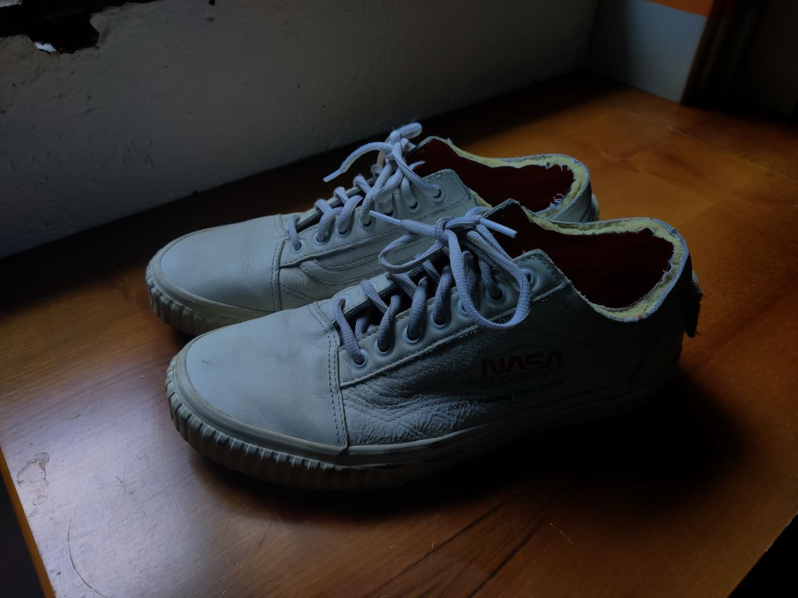
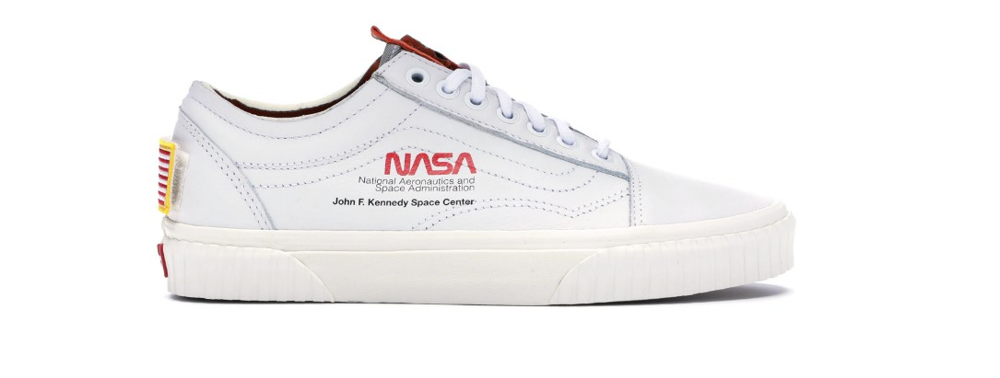

# under-overExposedImage
Very simple way to decide if an image is normal/under/overExposed using its histogram.  
The implemented method is quite stupid, it divides the histogram into 10 parts to establish the exposure of the image.  
Determines whether an image is `underExpose`, `overExpose` or `normal`.

## split the 255-len hinstogram
The function splits the 256 levels of the histogram according to the `nPart` variable.  
The surplus of the division is placed in the middle classes so as not to disturb the marginal ones that will be used to decide.  
See the two examples below to understand better.
__ex: nPart == 5__  
0-->50 51-->101 102-->152~~>153 154-->204 205-->255  
__ex: nPart ==10__  
0-->24 25-->49 50-->74 75-->99 100-->124~~>130 131-->155 156-->180 181-->205 206-->230 231-->255  

## decision for underExpose/overExpose/normal

To make the decision i use the comparison between the sum of the two most extreme partitions and the rest of the partitions.
In case the sum of the two partitions is > of the sum of remaining partitions, check that the opposite extreme is 0.
This is to avoid the possibility of detecting a white object on white background  as overeExpose (see the `caseError` example for a better understanding)

## result 
**overExposed**  

newArray:  [0.0, 0.0020166016, 0.003914388, 0.011096192, 0.027355958, 0.035923664, 0.05898112, 0.09416341, 0.14127849, 0.6252702]  
sum (must be ~1 ) : 1.0000000116415322  
over exposed  
**underExposed**  

newArray:  [0.32782716, 0.24546386, 0.21890381, 0.059091795, 0.07683187, 0.04322103, 0.028448893, 0.00021158854, 0.0, 0.0]  
sum (must be ~1 ) : 1.0000000050931703  
under exposed   
**normalImage**  

newArray:  [0.037280273, 0.09960531, 0.12129964, 0.08436361, 0.20913167, 0.2194165, 0.0678068, 0.06981364, 0.06792236, 0.023360189]  
sum (must be ~1 ) : 0.9999999925494194  
normal exposed image  
**normalImage(errorCase)**  

newArray:  [0.0005763172, 0.0033502642, 0.0025227892, 0.0027403096, 0.0054514674, 0.004327985, 0.006090574, 0.011909807, 0.12320181, 0.83982867]  
sum (must be ~1 ) : 0.9999999933643267  
normal exposed image  
 
